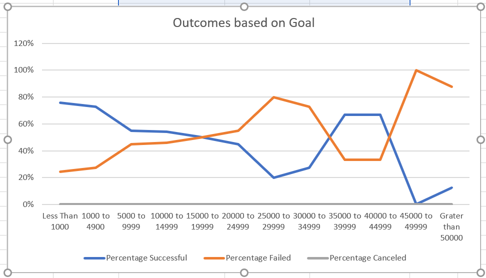
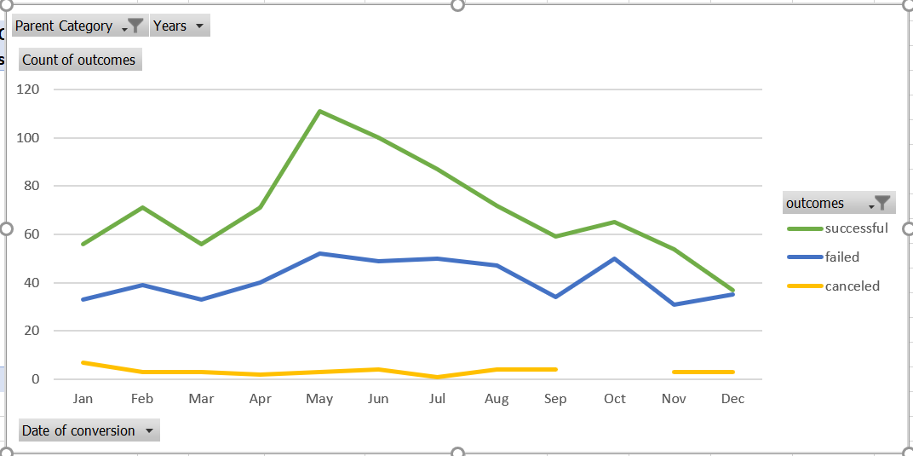

# -kickstarter-analysis
Performing analysis on Kickstarter data to uncover trends
* This is for data analysis
* This uses data-1-1-3-StarterBook.xlsx
* Please download zip file and unzip
### Challenge
# Outcomes Based on Goal
Successful, Failed and Cancel goals are shown in percent according to goal range on X-Axis for subcategory plays

# Outcomes based on Launch Dates
Successful, Failed and Canceled outcomes are shown again month for parent category theater. Month of May shows maximum successful outcome

# Report
## Analysis
* From data set we can find the number of successful outcome per country and per category and sub category
* Data set can give us when outcomes failed? Monthly, Quaterly etc
* Can be able to make guess depends of campaign lauched date and duration according to category that in future if same thing we do then will it be successful or not.
## Limitations
* From two graphs we can only tell successful, failed or canceled outcomes accrding to months or according goal amount, but to know more why it failed then we can have more graphs which inclued total campaign duration, number of backers, total donation
* We can plot graph which will give information about successful, failed and canceled outcomes based on average donation and number backers etc.

